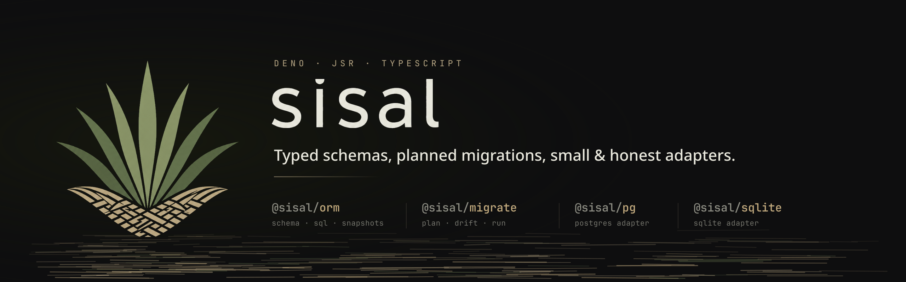

<p align="center">
  
</p>

# Sisal

Sisal is a focused Deno-first, JSR-native database toolkit.

It gives the ORM and migration work a dedicated product identity: schema
definitions, typed SQL, migration planning, migration execution, and small
database adapters. Sisal has no dependency on the former package namespace.

## Why Sisal Exists

The earlier implementation lived in a broader application ecosystem. Its ORM and
migration packages were useful, but database tooling needs a smaller surface
with clearer package boundaries and a name that can stand on its own.

Sisal keeps the useful database pieces and drops the broader framework shape:

- `@sisal/orm` is driverless and owns schema definitions, SQL fragments, query
  builders, schema snapshots, structured errors, and a minimal logger interface.
- `@sisal/migrate` owns migration definitions, checksums, planning, drift
  checks, file workflow helpers, and generic migration execution.
- `@sisal/pg` owns PostgreSQL execution, history storage, migrators, and DDL
  generation.
- `@sisal/sqlite` owns SQLite execution, history storage, migrators, and DDL
  generation.

The ORM does not import PostgreSQL, SQLite, Pequi Logger, or any legacy package.
Adapters depend on `@sisal/orm`; the ORM never depends on adapters.

## Packages

```text
packages/orm       Driverless ORM, schema, SQL, snapshots
packages/migrate   Adapter-neutral migration planning and running
packages/pg        PostgreSQL ORM and migration adapter boundary
packages/sqlite    SQLite ORM and migration adapter boundary
```

Supporting directories:

```text
examples/basic-postgres
examples/basic-sqlite
benchmarks
docs
```

## Quick Example

```ts
import { columns, createSchemaSnapshot, defineTable } from "@sisal/orm";
import { generatePostgresUpStatements } from "@sisal/pg/ddl";

const users = defineTable("users", {
  id: columns.uuid().primaryKey(),
  email: columns.text().notNull().unique(),
});

const snapshot = createSchemaSnapshot({
  dialect: "postgres",
  tables: [users],
});

const { statements } = generatePostgresUpStatements(snapshot);
```

## Logging

Sisal accepts a small generic logger interface:

```ts
interface Logger {
  debug(record: Record<string, unknown>, message: string): void;
  info(record: Record<string, unknown>, message: string): void;
  warn(record: Record<string, unknown>, message: string): void;
  error(record: Record<string, unknown>, message: string): void;
}
```

Pequi Logger is a recommended logger because it fits this shape, but it is not a
required dependency of `@sisal/orm`.

## Development

```sh
deno task check
deno task test
```

See [migration notes](./docs/migration-notes.md) for transition guidance.
