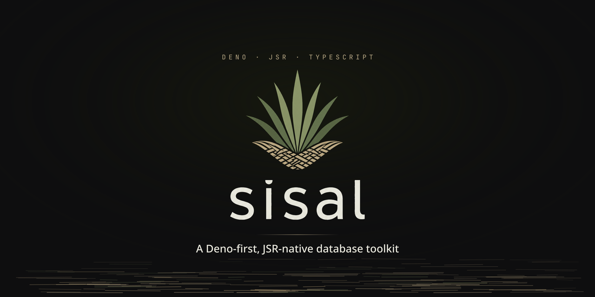

<p align="center">
  
</p>

# Sisal

Pronunciation: **Sisal** is read in Brazilian Portuguese as /siˈzaw/.

> [!WARNING]
> Sisal is still experimental. APIs, schema snapshot formats, generated DDL,
> migration workflows, and adapter behavior may change before 1.0. Review
> generated SQL and test migrations before using Sisal in production.

Sisal is a Deno-first **ORM and query builder**, published to JSR — typed
schemas, safe SQL builders, schema snapshots, migration planning, and explicit
database adapters — with **lightweight ETL and analytics capabilities** growing
on the same driverless core.

The core stays portable: `@sisal/orm` is driverless and `@sisal/migrate` is
adapter-neutral. PostgreSQL, Neon, SQLite, libSQL/Turso, and MySQL/MariaDB
behavior lives in adapter packages, where database drivers and runtime-specific
dependency edges belong.

Every Sisal package is published to JSR. The core packages stay pure JSR.
Adapter packages own runtime-specific driver edges: `@sisal/pg` defaults to
`jsr:@db/postgres` and can opt into `npm:postgres` with `driver: "postgres-js"`;
libSQL/Turso uses `npm:@libsql/client`; Neon uses `@neon/serverless`;
MySQL/MariaDB uses `npm:mysql2` by default with a lazy MariaDB connector opt-in.

Sisal is inspired by useful vocabulary from the TypeScript database ecosystem,
including Drizzle's fluent SQL-builder style, but it is not a compatibility
layer and keeps its own driverless core, snapshot workflow, and adapter split.

> [!NOTE]
> **Scope — a toe in the water, not a replacement.** Sisal is first an ORM and
> query builder. Its ETL and analytics layers ([v0.10](docs/v0.10.0-roadmap.md)
> and [v0.11](docs/v0.11.0-roadmap.md), in progress) are deliberately small: a
> typed rollup job with a single-run runner, and a typed query API over the
> shapes it produces — all pushed down into your existing database, no extra
> engine. The goal is to let a project already using Sisal for OLTP do
> lightweight in-database rollups and analytical reads **without standing up a
> separate stack on day one**. When a project outgrows that — real
> orchestration, streaming, a warehouse, a BI platform — Sisal is meant to hand
> off cleanly to a specialized tool, not to become one. It will not grow into a
> scheduler, a worker queue, or an object-first ORM.

## Installing

Install the core packages plus one adapter. For PostgreSQL:

```sh
deno add jsr:@sisal/orm@0.10.0 \
  jsr:@sisal/migrate@0.10.0 \
  jsr:@sisal/pg@0.10.0
```

Most projects need exactly three Sisal packages: `@sisal/orm`, `@sisal/migrate`,
and one adapter package. Swap only the adapter for the database runtime you use.

| Target        | Install                                                                             |
| ------------- | ----------------------------------------------------------------------------------- |
| PostgreSQL    | `deno add jsr:@sisal/orm@0.10.0 jsr:@sisal/migrate@0.10.0 jsr:@sisal/pg@0.10.0`     |
| Neon          | `deno add jsr:@sisal/orm@0.10.0 jsr:@sisal/migrate@0.10.0 jsr:@sisal/neon@0.10.0`   |
| SQLite        | `deno add jsr:@sisal/orm@0.10.0 jsr:@sisal/migrate@0.10.0 jsr:@sisal/sqlite@0.10.0` |
| libSQL/Turso  | `deno add jsr:@sisal/orm@0.10.0 jsr:@sisal/migrate@0.10.0 jsr:@sisal/libsql@0.10.0` |
| MySQL/MariaDB | `deno add jsr:@sisal/orm@0.10.0 jsr:@sisal/migrate@0.10.0 jsr:@sisal/mysql@0.10.0`  |

`deno add` writes bare package aliases to `deno.json`, so application code can
import from `@sisal/orm`, `@sisal/migrate`, and the chosen adapter.

## PostgreSQL Walkthrough

This example defines a small feed schema, generates additive PostgreSQL DDL,
connects through the PostgreSQL adapter with `await using` for automatic
cleanup, writes with a batched transaction, updates with a SQL expression, and
reads a keyset-paginated page.

```ts
import {
  columns,
  createSchemaSnapshot,
  defineTable,
  desc,
  eq,
  index,
  type InferInsert,
  type InferSelect,
  sql,
} from "@sisal/orm";
import { connect, generatePostgresUpStatements } from "@sisal/pg";

const users = defineTable("users", {
  id: columns.uuid().primaryKey(),
  email: columns.text().notNull().unique(),
  displayName: columns.text().notNull(),
  createdAt: columns.timestamp({ withTimezone: true }).notNull(),
});

const posts = defineTable("posts", {
  id: columns.uuid().primaryKey(),
  authorId: columns.uuid().notNull().references("users", "id"),
  title: columns.text().notNull(),
  status: columns.text().notNull(),
  score: columns.integer().notNull().default(0),
  upvotes: columns.integer().notNull().default(0),
  downvotes: columns.integer().notNull().default(0),
  createdAt: columns.timestamp({ withTimezone: true }).notNull(),
}, (t) => [
  index("posts_feed_idx")
    .where(sql`${t.status} = 'published'`)
    .on(desc(t.score), desc(t.createdAt), desc(t.id)),
]);

type Post = InferSelect<typeof posts>;
type NewPost = InferInsert<typeof posts>;

const snapshot = createSchemaSnapshot({
  dialect: "postgres",
  tables: [users, posts],
});

// `await using` closes the connection pool when the scope exits — including on
// an early throw — so no try/finally is needed. (Call `await db.close()`
// manually if you need to release it sooner.)
await using db = await connect({
  url: Deno.env.get("DATABASE_URL"),
});

const { statements, destructive } = generatePostgresUpStatements(snapshot);

if (destructive.length > 0) {
  throw new Error("Refusing to apply destructive generated changes.");
}

for (const statement of statements) {
  await db.execute(statement);
}

const userId = crypto.randomUUID();
const postId = crypto.randomUUID();

await db.batch([
  db.insert(users).values({
    id: userId,
    email: "ada@example.com",
    displayName: "Ada",
    createdAt: Temporal.Now.instant(),
  }),
  db.insert(posts).values({
    id: postId,
    authorId: userId,
    title: "Portable database tooling",
    status: "published",
    score: 0,
    upvotes: 3,
    downvotes: 1,
    createdAt: Temporal.Now.instant(),
  }),
]);

await db.update(posts).set({
  score: sql`${posts.columns.upvotes} - ${posts.columns.downvotes}`,
}).where(eq(posts.columns.id, postId)).execute();

const page = await db.select({
  id: posts.columns.id,
  title: posts.columns.title,
  author: users.columns.displayName,
  score: posts.columns.score,
  createdAt: posts.columns.createdAt,
}).from(posts)
  .innerJoin(users, eq(users.columns.id, posts.columns.authorId))
  .where(eq(posts.columns.status, "published"))
  .keyset({
    orderBy: [
      desc(posts.columns.score),
      desc(posts.columns.createdAt),
      desc(posts.columns.id),
    ],
  })
  .limit(20)
  .execute();

console.log(page.rows, page.nextCursor);
```

`generatePostgresUpStatements` is intentionally additive: destructive changes
are reported separately instead of silently emitted as ordinary migration SQL.
For long-lived projects, use the CLI workflow below to write migration files and
track snapshots.

## CLI Task Setup

Wire the migration CLI into your application's `deno.json` so the same commands
work locally and in CI:

```json
{
  "tasks": {
    "sisal": "deno run --allow-read --allow-write --allow-env --allow-net jsr:@sisal/migrate@0.10.0/cli",
    "db:init": "deno task sisal init --target postgres",
    "db:generate": "deno task sisal generate",
    "db:migrate": "deno task sisal migrate",
    "db:status": "deno task sisal status",
    "db:drift": "deno task sisal drift"
  }
}
```

Use `--target mysql` for MySQL/MariaDB. SQLite and libSQL/Turso tasks also need
`--allow-ffi`. `sisal init` creates `sisal.migrate.ts`; edit that config so
`snapshot` is built from the same table definitions your application uses.

```ts
import { createSchemaSnapshot } from "@sisal/orm";
import { defineConfig } from "@sisal/migrate/workflow";
import { posts, users } from "./src/db/schema.ts";

export default defineConfig({
  dir: "migrations",
  dialect: "postgres",
  snapshot: createSchemaSnapshot({
    dialect: "postgres",
    tables: [users, posts],
  }),
  databaseUrl: Deno.env.get("DATABASE_URL"),
  historyTable: "sisal_migrations",
});
```

Typical workflow:

```sh
deno task db:init
deno task db:generate create posts
deno task db:migrate
deno task db:status
deno task db:drift
```

`generate` diffs the latest `*.snapshot.json` in the migrations directory
against `config.snapshot`, then writes paired SQL and snapshot files. `drift`
exits with code `1` when the current schema snapshot, migration files, or
database plan do not match.

## What You Get Today

- Typed schemas with `InferSelect` and `InferInsert`.
- Nullable-by-default columns, explicit `.notNull()`, `.optional()`, defaults,
  primary keys, unique constraints, checks, and foreign keys.
- Temporal-aware `date`, `time`, and `timestamp` columns, with legacy `Date` and
  raw string modes when requested.
- Typed SQL fragments with safe parameter rendering and explicit trusted escapes
  for identifiers or raw SQL.
- `select`, `insert`, `insert().select()`, `update`, and `delete` builders with
  guarded update/delete execution.
- Joins, aggregates, conditional aggregate `filter(...)`, ordering helpers,
  CTEs, set operations, `returning`, and upserts.
- Portable date helpers such as `dateTrunc`, `dateAdd`, `dateSub`, `dateBin`,
  and `now`.
- `sql` expressions in `values`, `set`, and upsert sets, plus `excluded(column)`
  for portable upsert set clauses.
- `db.batch([...])` for atomic non-interactive batches.
- Keyset pagination with inferred cursor shapes.
- `relations()` metadata and `db.query.<table>` helpers for schema-aware
  database facades.
- Typed database function callers through `defineFunction` and `db.call`.
- Schema snapshots v2, snapshot diffing, and additive DDL generation.
- Rich index DDL with `asc`/`desc`, partial `WHERE`, and expression keys.
- Migration planning, checksums, rollback, history stores, drift checks, and a
  CLI workflow.
- Adapter packages for PostgreSQL, Neon, SQLite, libSQL/Turso, and
  MySQL/MariaDB.
- Structured `SisalError`, `OrmError`, and `MigrationError` classes plus
  configurable logger contracts.

The v0.9 release also landed the substrate the ETL layer builds on — a portable
advisory-lock/claim abstraction, an atomic load-and-advance checkpoint, and a
replay-vs-retention guard. The `@sisal/etl` preview (a typed rollup job + a
single-run, SQL-pushdown runner) and the `@sisal/analytics` preview are the
[v0.10](docs/v0.10.0-roadmap.md) and [v0.11](docs/v0.11.0-roadmap.md) roadmap
milestones — lightweight by design, per the scope note above.

## Packages

Core packages:

| Package          | Purpose                                                                                                                                                 |
| ---------------- | ------------------------------------------------------------------------------------------------------------------------------------------------------- |
| `@sisal/core`    | The public driverless base (extracted in v0.8): schema primitives, the SQL IR, expression operators, the capability registry, and the dialect renderer. |
| `@sisal/orm`     | Driverless schema definitions, typed SQL, query builders, snapshots, structured errors, and configurable logging.                                       |
| `@sisal/migrate` | Adapter-neutral migrations, checksums, planning, drift checks, workflow helpers, generic runner, and CLI config.                                        |

`@sisal/core` is a public JSR package, but `@sisal/orm` re-exports its entire
surface — most projects install `@sisal/orm` + `@sisal/migrate` + one adapter
and never import `@sisal/core` directly. Depend on it directly only when you
want the schema/SQL-IR layer without the query builders (as `@sisal/migrate`
does).

Adapter packages:

| Package         | Purpose                                                                                                          |
| --------------- | ---------------------------------------------------------------------------------------------------------------- |
| `@sisal/pg`     | PostgreSQL execution, pool boundary, migration history, migrator, and PostgreSQL DDL generation.                 |
| `@sisal/neon`   | Neon serverless PostgreSQL adapter over `@neon/serverless`, reusing PostgreSQL SQL, DDL, and migrator behavior.  |
| `@sisal/sqlite` | SQLite execution via `jsr:@db/sqlite`, migration history, migrator, and SQLite DDL generation.                   |
| `@sisal/libsql` | libSQL/Turso execution via `npm:@libsql/client`, migration history, migrator, and SQLite-compatible DDL aliases. |
| `@sisal/mysql`  | MySQL/MariaDB execution via `npm:mysql2` or the MariaDB connector, migration history, migrator, and MySQL DDL.   |

Core packages stay driverless and adapter-neutral. Adapter packages are where
database drivers and runtime-specific dependencies belong.

## Adapter Notes

- PostgreSQL uses the PostgreSQL dialect, placeholders, schema support, and DDL
  helpers through `@sisal/pg`. It defaults to `jsr:@db/postgres`; opt into the
  faster postgres.js path with `connect({ url, driver: "postgres-js" })`, and
  use `prepare: false` for PgBouncer or pooled endpoints when needed.
- Neon uses serverless PostgreSQL over `@neon/serverless` through `@sisal/neon`.
- SQLite runs local SQLite through `jsr:@db/sqlite`; Deno execution needs
  `--allow-ffi`.
- libSQL/Turso follows the SQLite-compatible dialect through
  `npm:@libsql/client`.
- MySQL/MariaDB use `@sisal/mysql` with `mysql2` by default; opt into the
  MariaDB connector with `connect({ url, driver: "mariadb" })`.

## Development

Common repository checks:

```sh
deno task fmt:check
deno lint
deno task check
deno task test
deno task docs:check
deno task docs:llms:check
deno task docs:matrix:check
```

Integration suites are opt-in because they use real database drivers or
services:

```sh
DATABASE_URL=postgres://... deno test -A integration/pg_features_test.ts
SISAL_PG_DRIVER=postgres-js DATABASE_URL=postgres://... \
  deno test -A integration/pg_features_test.ts
NEON_DATABASE_URL=postgres://... deno test -A integration/neon_features_test.ts
SISAL_SQLITE_IT=1 deno test --allow-ffi --allow-read --allow-write \
  --allow-env --allow-net integration/sqlite_features_test.ts
SISAL_LIBSQL_IT=1 deno test -A integration/libsql_features_test.ts
SISAL_MYSQL_IT=1 MYSQL_URL=mysql://... deno test -A integration/mysql_features_test.ts
SISAL_MARIADB_IT=1 MARIADB_URL=mysql://... deno test -A integration/mariadb_features_test.ts
DATABASE_URL=postgres://... deno test --allow-net --allow-env --allow-read \
  integration/pg_migrate_apply_test.ts
DATABASE_URL=postgres://... deno test --allow-net --allow-env --allow-read \
  --allow-ffi integration/cross_adapter_parity_test.ts
```

The scheduled integration workflow covers PostgreSQL 16/17/18 through Docker,
Neon through the bundled local WebSocket proxy, local SQLite/libSQL execution,
and MySQL/MariaDB through Docker services.

## README Disclaimer

This README was generated and revised with AI assistance. It may contain errors,
omissions, outdated examples, or inaccuracies. The source code, package
manifests, tests, and generated API documentation are the authoritative project
references.
